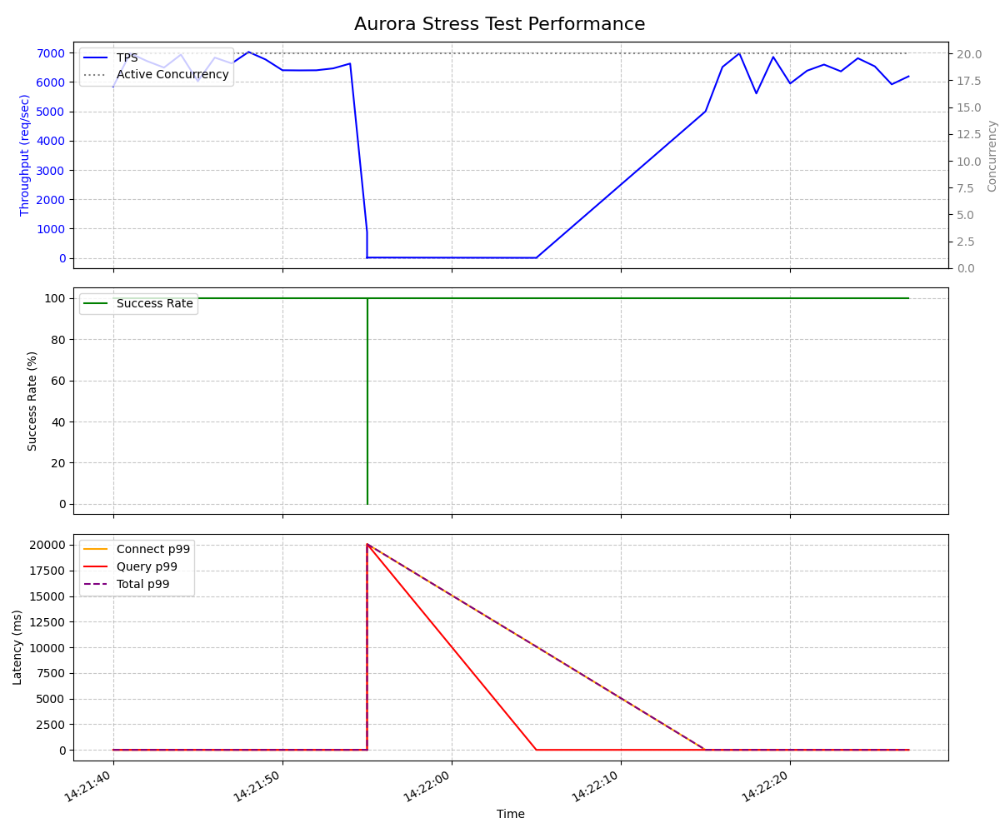

# Aurora MySQL 短命接続ストレステストツール

「毎回 connect -> SQL実行 -> disconnect」を繰り返し、新規接続のレイテンシや短命接続時の成功率、および時間帯ごとのパフォーマンス劣化（connection storm等の影響）を計測するためのツールです。

## 特徴
- **集約ログ中心**: 全試行を1行ずつ吐き出さず、`1s`, `10s`, `1m` といった指定の「時間バケット」ごとに各種メトリクス（成功率、スループット、各レイテンシのパーセンタイル）を JSON Lines で出力します。
- **失敗詳細ログ**: 成功した通信の詳細は省き、失敗した試行のみ別途 `error.jsonl` に詳細を記録します。
- **Go実装**: コネクションプールを無効化し、高並列な goroutine で直接 endpoint に接続します。
- **Linux 事前チェック**: OSのTCPスタックやファイルディスクリプタ上限でボトルネックにならないかを診断する `preflight.sh` を同梱しています。

## 動作要件
- Go 1.20+
- Python 3.7+ (集約ログの簡易閲覧用 `analyze.py`)

## 準備とビルド
```bash
cd aurora-con-stress-test
chmod +x preflight.sh

# 依存パッケージをダウンロード
go mod tidy

# ツールをビルド
go build -o stress-test main.go
```

## Linux 事前チェック (Preflight Check)
高並列テストを実施するホスト（EC2インスタンスなど）で、OSのパラメータ不足で失敗しないか確認します。

```bash
./preflight.sh
```

### 数万コネクション級の注意（ネットワークバッファ）
短命接続（TCPのオープン/クローズ）を極端に繰り返す場合、OSのTCPスタック側でバッファ不足がボトルネックになることがあります。
特に **数万同時接続** を狙う場合は、以下のネットワークバッファ関連の上限が十分かを確認してください（本ツールの `preflight.sh` でチェックします）。

- `net.core.rmem_max`（例: 推奨 >= 16777216）
- `net.core.wmem_max`（例: 推奨 >= 16777216）
- `net.ipv4.tcp_rmem`（max値=3つ目。例: 推奨 >= 16777216）
- `net.ipv4.tcp_wmem`（max値=3つ目。例: 推奨 >= 16777216）

※ 一般的な **1,000〜5,000 並列** 程度のテストであれば、これらがデフォルトでも問題化しないことも多いですが、数万並列では顕在化しやすいです。

## テストの実行
```bash
./stress-test \
  -host "your-aurora-cluster.cluster-xyz.ap-northeast-1.rds.amazonaws.com" \
  -port 3306 \
  -user "admin" \
  -password "secret" \
  -database "mydb" \
  -sql "SELECT 1" \
  -concurrency 100 \
  -duration 10m \
  -aggregate_window 10s \
  -aggregate_log_path "aggregate.jsonl" \
  -error_log_path "error.jsonl" \
  -connect_timeout 5s \
  -query_timeout 10s \
  -dial_timeout 5s \
  -tls_mode "true"
```

### パラメータ
- `-host` (デフォルト: `127.0.0.1`): 対象の MySQL / Aurora ホスト
- `-port` (デフォルト: `3306`): 対象のポート番号
- `-user` (デフォルト: `root`): MySQL ユーザー
- `-password` (デフォルト: `""`): MySQL パスワード
- `-database` (デフォルト: `""`): 使用するデータベース名
- `-sql` (デフォルト: `SELECT 1`): 実行するクエリ
- `-concurrency` (デフォルト: `10`): 並列ワーカー数（ゴルーチン数）
- `-duration` (デフォルト: `60s`): 試験の実施時間（例: `10m`, `1h`）
- `-connect_timeout` (デフォルト: `5s`): 接続フェーズ全体のタイムアウト
- `-query_timeout` (デフォルト: `10s`): クエリ実行フェーズのタイムアウト
- `-dial_timeout` (デフォルト: `5s`): TCP接続のタイムアウト時間
- `-tls_mode` (デフォルト: `""`): TLS接続モード（`''`: 無効, `'true'`: 有効, `'skip-verify'`: 証明書検証スキップ, `'custom'`: カスタムTLS）
- `-run_id` (デフォルト: `run-<UnixTime>`): テスト実行の識別子
- `-aggregate_log_path` (デフォルト: `aggregate.jsonl`): 集約ログの出力ファイルパス
- `-error_log_path` (デフォルト: `error.jsonl`): エラーログの詳細出力先
- `-aggregate_window` (デフォルト: `10s`): ログを集約する時間バケット幅（例: `1s`, `1m`）
- `-sleep_between_attempts` (デフォルト: `0`): 次の試行までのスリープ時間（例: `10ms`, `1s`）

#### コネクションストーム（スパイク）のシミュレーション
- `-spike_concurrency` (デフォルト: `0`): スパイク時に追加で発生させる同時接続数
- `-spike_duration` (デフォルト: `0`): スパイクの継続時間（例: `5s`）
- `-spike_interval` (デフォルト: `0`): スパイクを発生させる間隔（例: `1m`）
※ 普段は `-concurrency` の数で負荷をかけつつ、`-spike_interval` 経過毎に `-spike_duration` の間だけ `-spike_concurrency` 個のワーカーが追加で一斉に接続を行います。

## パラメータの選定 (目標QPSからの計算)
ターゲットとする QPS を指定すると、推奨される `-concurrency` と `-sleep_between_attempts` の組み合わせを提案するツールが付属しています。

```bash
python3 suggest_params.py <目標QPS>
```

**実行例 (4,000 QPS を狙いたい場合):**
```bash
$ python3 suggest_params.py 4000
--- Suggestion for 4000 QPS (Assumed Latency: 15ms) ---
Option (Sleep 10ms): -concurrency 100  (Theory: 4000.0 QPS)
Option (Sleep 20ms): -concurrency 140  (Theory: 4000.0 QPS)
...

--- Suggestion for 4000 QPS (Assumed Latency: 30ms) ---
Option (Sleep 10ms): -concurrency 160  (Theory: 4000.0 QPS)
Option (Sleep 20ms): -concurrency 200  (Theory: 4000.0 QPS)
...
```

- **健康時 (Latency 15ms)**: DBに負荷がかかっていない状態での最速の指標です。
- **混雑時 (Latency 30ms)**: 負荷がかかり、DBの応答が少し遅れ始めた状態の指標です。エラーを避けつつ目標QPSを維持したい場合は、こちらのパターンから設定を選ぶことを推奨します。

## バッチ連続実行 (一括テスト)
複数の QPS ターゲットを連続してテストし、結果を整理して保存するための自動実行スクリプトです。

1. **QPSリストファイルの作成**
   実行したい QPS を1行ずつ記述したファイルを用意します（例: `targets.txt`）。
   ```text
   1000
   2000
   3000
   ```

2. **スクリプトの実行**
   ```bash
   python3 batch_run.py targets.txt \
     --host "your-cluster..." \
     --user "admin" \
     --password "secret"
```

各 QPS に対して「Healthy (低遅延想定)」と「Congested (高遅延想定)」の2つのシナリオを自動計算して実行します (各5分)。
結果は `results/qps{QPS}_{scenario}/` ディレクトリに、ログとグラフがセットで保存されます。

## ログの確認とグラフ化 (Plot)
集約ログは1バケット1行の JSON Lines で出力されます。
これを同梱の Python スクリプトで簡単に視覚化・グラフ化できます。

Pythonの環境構築および実行には、高速なパッケージマネージャである **`uv`** を使用します。

### 1. `uv` のインストールと環境準備
まだ `uv` がインストールされていない場合は、以下のコマンドでインストールしてください。
```bash
curl -LsSf https://astral.sh/uv/install.sh | sh
```

次に、依存関係（`matplotlib` 等）をインストールします。
```bash
cd aurora-con-stress-test
uv sync
```

### 2. グラフの描画
テストが完了したら、以下のコマンドで集約ログからグラフ（PNG画像）を生成します。

```bash
uv run plot.py aggregate.jsonl -o result.png
```

出力された `result.png` には、「スループット(TPS)」「成功率」「レイテンシ(p99)」の3つのグラフが時系列でプロットされ、パフォーマンスの悪化ポイントが一目で確認できます。



### 3. CUIでの簡易分析
ターミナル上でテキストとしてサマリーを見たい場合は、`analyze.py` を使用します。

```bash
uv run analyze.py aggregate.jsonl
```

#### `analyze.py` の便利なフィルタ機能
長期間のテストログから「パフォーマンスが悪化したポイント」だけを素早く探すためのオプションが用意されています。

**① エラーが発生した時間帯のみ抽出**
```bash
python3 analyze.py aggregate.jsonl --errors-only
```
（成功率が100%の時間帯をスキップし、エラーが起きたバケットのみを表示します）

**② レイテンシが悪化した時間帯のみ抽出**
```bash
python3 analyze.py aggregate.jsonl --latency-threshold 100
```
（全体のレイテンシの p99 が 100ms を超えた時間帯のみを表示します）

### コネクションレイテンシの集計について
本ツールは「コネクションプーリングを無効化」し、1試行ごとに毎回 `sql.Open -> db.Ping -> db.Query -> db.Close` を行っています。
そのため、DBが大量の新規接続（スパイク）を受けて「接続を出し渋る（Acceptキューが詰まるなど）」といった事象が発生した場合、それは明確に **`Conn` (Connect Latency) の悪化** として集約ログ（p90/p99/max 等）に記録されます。

```text
======================================================================
AURORA STRESS TEST AGGREGATE ANALYSIS REPORT
======================================================================
[2024-05-01 10:00:00] Attempts: 320   | TPS:   32.0 | Overall Success: 100.00% | Conn Success: 100.00%
    Latency (ms) p90/p99 -> Conn: 15/45 | Query: 5/12 | Total: 22/58
----------------------------------------------------------------------
[2024-05-01 10:00:10] Attempts: 315   | TPS:   31.5 | Overall Success:  98.50% | Conn Success: 100.00%
    Latency (ms) p90/p99 -> Conn: 25/80 | Query: 6/15 | Total: 35/99
    Failures: {'query': 5}
    Errors:   {'dial tcp 127.0.0.1:3306: i/o timeout': 5}
----------------------------------------------------------------------
```

## ⚠️ 長時間（数日〜1週間）負荷をかける際の注意事項

長期間の負荷テスト（例: `-duration 168h`）を実施する際は、以下の点に注意してください。

### 1. `aggregate_window`（時間バケット）の適切な設定
数日間にわたるテストの場合、`-aggregate_window` を短くしすぎると（例: `1s`）、ログが肥大化します。
長期間テストの場合は **`10s` または `1m`** に設定することを推奨します。
（`1m` の場合、1時間で60行、1週間で約10,000行、数MB程度のサイズに収まります）

### 2. エラーログ (`error.jsonl`) の肥大化リスク
本ツールは「成功した試行の詳細は出力せず、**失敗した試行のみ** 詳細を `error.jsonl` に出力」します。
通常はサイズ0のままですが、Auroraが完全にダウンし数万件の接続エラーが継続して発生するような事態に陥った場合、`error.jsonl` が急速に肥大化（数GBなど）する可能性があります。ディスク容量に余裕のあるパーティションで実行してください。

### 3. バックグラウンドでの実行
SSH接続を切ってもテストが継続するよう、`nohup` や `tmux`、`screen` などを利用して実行してください。

**長時間実行用コマンド例 (1週間稼働):**
```bash
nohup ./stress-test \
  -host "your-aurora-cluster.rds.amazonaws.com" \
  -user "admin" \
  -password "secret" \
  -database "mydb" \
  -concurrency 100 \
  -duration 168h \
  -aggregate_window 1m \
  -spike_interval 5m \
  -spike_duration 10s \
  -spike_concurrency 500 \
  > stress-test.log 2>&1 &
```

## db.r8g.xlarge 向け 48時間ロングラン実行

週末の 48 時間連続テスト（2000QPS）を簡単に実行するための補助スクリプトを追加しています。

- `run_longrun_test.sh`: 実行オーケストレーション（preflight -> 実行 -> 監視 -> 分析）
- `monitor_resources.py`: `/proc` ベースのリソース監視（30秒間隔）
- `analyze_longrun.py`: 成功率・劣化率（初期1時間 vs 最終1時間）の合否判定

### 実行例

```bash
chmod +x run_longrun_test.sh

./run_longrun_test.sh \
  --host "your-aurora-cluster.cluster-xyz.ap-northeast-1.rds.amazonaws.com" \
  --user "admin" \
  --password "secret" \
  --database "mydb" \
  --qps 2000 \
  --duration 48h \
  --concurrency 50 \
  --sleep-ms 10
```

### 出力先

実行ごとに以下のディレクトリが作成されます。

- `results/db_r8g_xlarge/longrun_qps2000_48h_<timestamp>/aggregate.jsonl`
- `results/db_r8g_xlarge/longrun_qps2000_48h_<timestamp>/error.jsonl`
- `results/db_r8g_xlarge/longrun_qps2000_48h_<timestamp>/resources.jsonl`
- `results/db_r8g_xlarge/longrun_qps2000_48h_<timestamp>/summary.txt`
- `results/db_r8g_xlarge/longrun_qps2000_48h_<timestamp>/summary.json`

### 既定の判定しきい値

- 全体成功率: `>= 99.5%`
- スループット劣化: `<= 10%`（初期1時間比）
- p99悪化率: `<= 10%`（初期1時間比）
